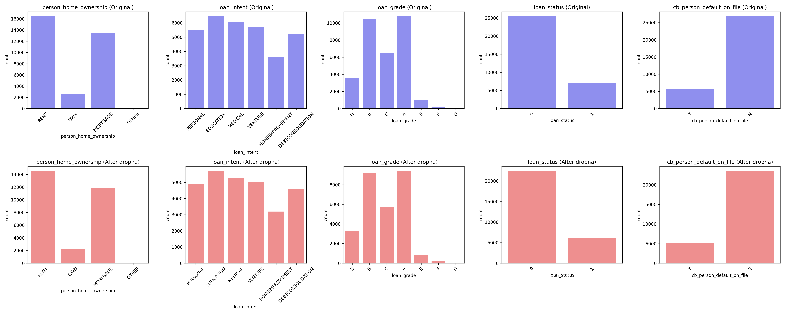
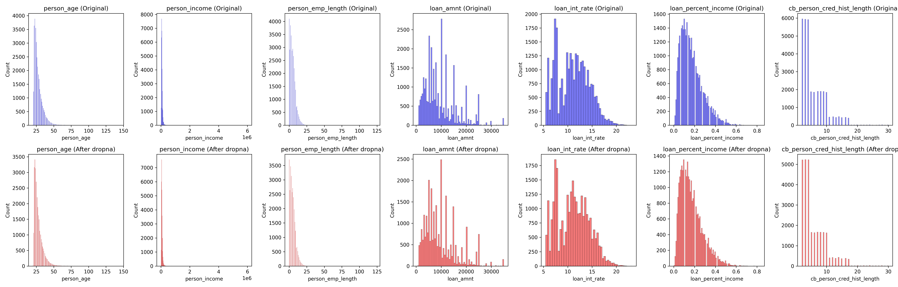
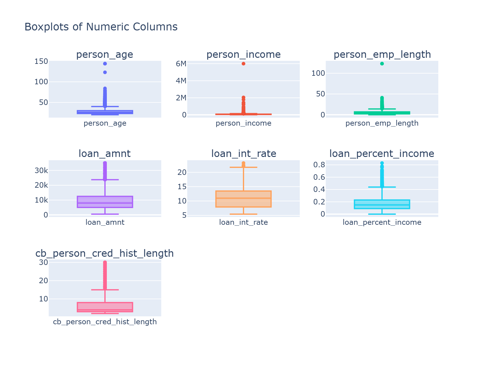
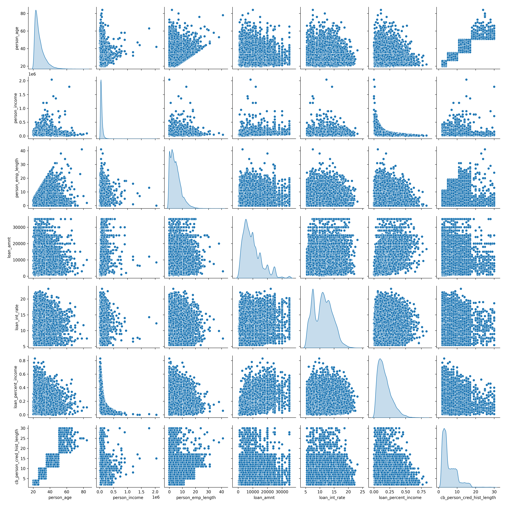
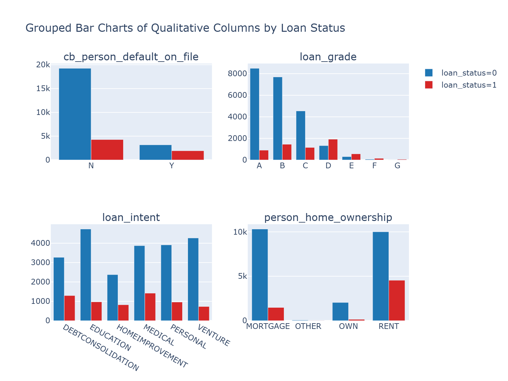
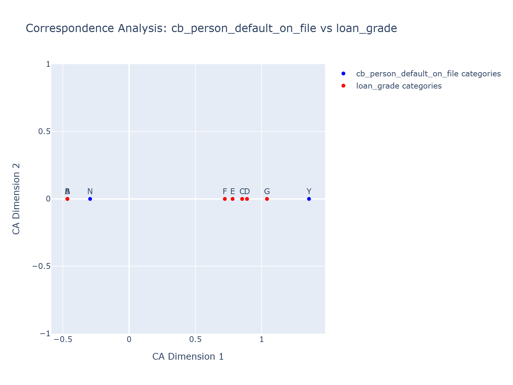

# Credit Risk EDA (OpenML 43454)

This repository contains an Exploratory Data Analysis (EDA) project on consumer credit risk using the OpenML **Credit-Risk-Dataset** (ID 43454). The goal is to understand patterns related to loan default behavior and the relationships between borrower attributes, loan characteristics, and default outcomes.

## Dataset

**Source:** [OpenML Credit-Risk-Dataset (ID 43454)](https://www.openml.org/d/43454)

- License: CC0 (Public Domain)
- Format: ARFF
- Instances: 32,581
- Features: 12
- Missing values: 4,011 (3,943 instances with missing values)
- Target: `loan_status` (0 = non-default, 1 = default)

### Features

- `person_age`: Age
- `person_income`: Annual income
- `person_home_ownership`: Home ownership (categorical)
- `person_emp_length`: Employment length (years)
- `loan_intent`: Loan intent (categorical)
- `loan_grade`: Loan grade (categorical)
- `loan_amnt`: Loan amount
- `loan_intrate`: Interest rate
- `loan_status`: Default status (label)
- `loan_percent_income`: Loan amount as % of income
- `cb_person_default_on_file`: Historical default on file
- `cb_person_cred_hist_length`: Credit history length

## Project Overview

### Objectives

- Assess class balance and default rates
- Explore relationships between borrower attributes and default
- Analyze loan characteristics (grade, intent, interest rate) vs risk
- Handle and characterize missing values

### Example Questions

- How does `loan_grade` relate to default probability?
- Does higher `loan_percent_income` correlate with higher default risk?
- Which `loan_intent` categories carry higher risk?
- How do age, income, and credit history length interact with default?

## Key Visualizations

This section showcases the main visualizations generated from our exploratory data analysis, organized by analysis type:

## Univariate Analysis

### Categorical Features Distribution

Distribution patterns of categorical variables in the dataset, including loan intent, home ownership, and loan grade distributions. This helps understand the composition of borrowers and loan characteristics.

### Numerical Features Distribution

Distribution of continuous variables such as age, income, loan amount, and interest rate, helping identify patterns, skewness, and potential outliers in individual features.

### Box Plot Analysis

Box plots revealing the statistical properties of numerical features including median, quartiles, and outliers, essential for understanding data quality and distribution characteristics of each variable.

## Bivariate Analysis

### Pairplot Analysis (Quan vs Quan)

Comprehensive pairwise relationships between numerical features, revealing both linear and non-linear relationships that inform feature selection and engineering strategies.

### Categorical Variables by Loan Status (Qual vs Qual)

Grouped bar chart showing the distribution of qualitative/categorical variables (such as home ownership, loan intent, and loan grade) segmented by loan status (default vs non-default), revealing which categories are associated with higher default rates.

### Correspondence Analysis

Correspondence analysis visualization showing the association between two categorical features with high association strength, as determined by Chi-square test and Cramér's V statistic. This technique reveals patterns of association and dependency between categorical variables in a lower-dimensional space.

## Contributors

| Avatar | Name | Role | GitHub |
|--------|------|------|--------|
|  | Dr. HAS Sothea | Lecturer | [hassothea](https://github.com/hassothea) |
|  | PHETH Soriyuon | Team Member | [PHETH-SORIYUON](https://github.com/PHETH-SORIYUON) |
|  | PHOEURN Kimhor | Team Member | [phoeurnkimhor](https://github.com/phoeurnkimhor) |
|  | YIN Sambat | Team Member | [Petit-x-garcon](https://github.com/Petit-x-garcon) |

